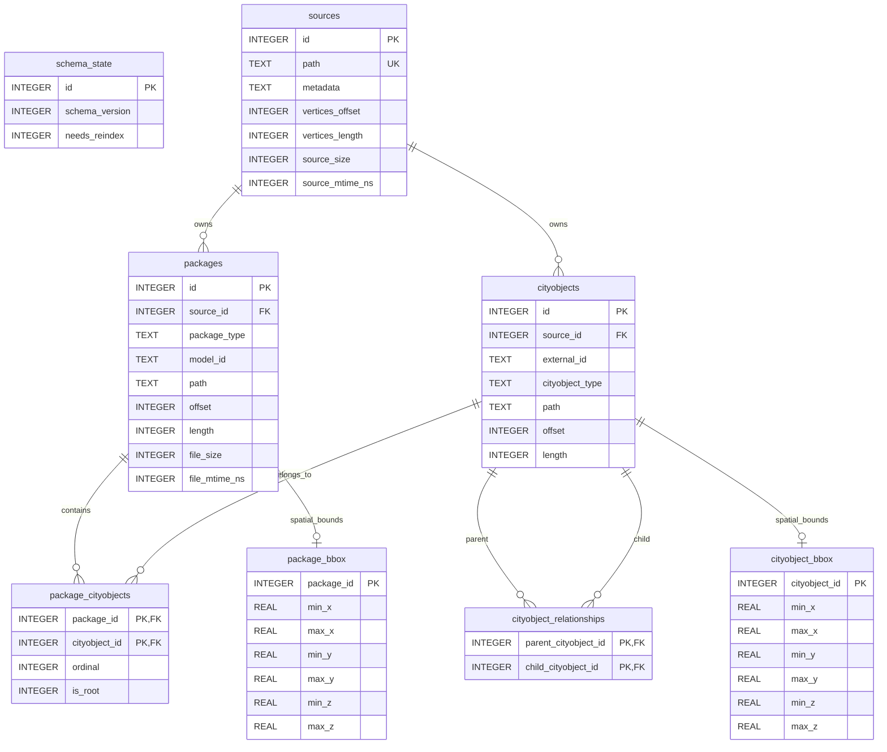

# Normalize Package and CityObject Indexing

## Status

Accepted

## Date

2026-06-02

## Supersedes

This ADR supersedes ADR-006, "Index Feature Package CityObject Keys".
ADR-006 remains the historical record for the alias-based intermediate design.

This decision also refines the package paging behavior described by ADR-003 and
replaces the feature-bound storage shape described by ADR-004. It preserves the
existing 2D bbox query input while storing complete XYZ bounds in the new
RTrees.

## Context

`cityjson-index` indexes three physical CityJSON layouts:

- regular `cityjson` documents with shared metadata, shared vertices, and a
  `CityObjects` dictionary
- `cityjson-seq` streams with one metadata header followed by
  `CityJSONFeature` lines
- `feature-files` trees with ancestor metadata files and standalone
  `CityJSONFeature` files

The current schema models every indexed identifier as a row in `features`.
That row is overloaded: it is used as an ID alias, a reconstruction location,
a bbox-query hit, and a paging unit. Those roles are not equivalent.

For regular `cityjson`, a root CityObject has one feature row and descendants
are hidden inside the JSON-encoded `member_ranges` column. Descendants are not
directly addressable in the same way as roots. For `cityjson-seq` and
`feature-files`, every CityObject ID in a package becomes a feature-row alias,
but every alias points to the same package byte range. A Building and its
BuildingPart therefore produce multiple index rows that reconstruct the same
complete package.

This alias-based representation creates observable problems:

- layouts index equivalent CityObjects differently
- package paging repeats one physical package for each CityObject alias
- downstream filtering can decode repeated packages, retain the same child
  repeatedly, and emit duplicates
- bbox rows and counts are repeated for aliases instead of representing actual
  packages or actual CityObjects
- a singular API can silently discard valid duplicate external IDs
- `member_ranges` encodes a regular-CityJSON-only relationship model inside one
  column instead of making CityObject relationships queryable

The index needs two first-class concepts:

1. a **package**, which is the smallest complete and valid `CityJSONFeature`
   return unit
2. a **CityObject occurrence**, which is a directly addressable physical JSON
   object fragment with an external ID that is not globally unique

The schema must also preserve source-level reconstruction context. Metadata,
shared vertices, and freshness data belong to a physical source and should not
be copied into each package.

## Decision

Replace alias-based `features` indexing with normalized source, package, and
CityObject records. Store package membership and CityObject relationships in
explicit join tables. Store complete XYZ bounds in package and CityObject
RTrees. Remove `member_ranges`, `feature_bbox`, `bbox_map`, and the overloaded
`features` table.

Expose package-oriented paging, reconstruction, and bbox-query APIs. Expose
CityObject-oriented plural lookup, relationship traversal, and granular bbox
query APIs. External CityObject IDs are not unique, and no public convenience
API may silently select the first matching occurrence or containing package.

Use CityJSON ecosystem terminology consistently:

- `cityjson`
- `cityjson-seq`
- `feature-files`

Legacy sidecars are not rewritten in place. They are marked as requiring
reindexing, and a full scan transactionally replaces the prior records only
after validation succeeds.

## Decision Rationale

### Separate Sources from Packages

A source is a physical freshness and reconstruction context. A package is a
valid public return unit. They are deliberately separate because one source can
yield many packages:

- one regular `cityjson` document can yield many synthetic root-descendant
  packages while sharing one metadata document and one vertices array
- one `cityjson-seq` stream can yield many feature-line packages while sharing
  one header
- one `feature-files` metadata file can govern many standalone feature files

Keeping `sources` separate avoids duplicated metadata and shared-vertices
locations. It also gives freshness checks one authoritative place to compare
source size and mtime. `source_id`, paths, and byte ranges remain private so
public refs stay independent of physical layout details.

### Make Packages the Reconstruction and Paging Unit

A package is the unit that can be reconstructed into a valid
`CityJSONFeature`. Paging and package bbox queries therefore operate on
packages, not CityObject aliases. This prevents repeated decode work and
prevents downstream filters from receiving duplicate copies of the same
package merely because multiple indexed CityObjects belong to it.

The package location policy follows the fastest correct read path:

- regular `cityjson` packages are synthetic and use `NULL` package byte ranges;
  reconstruction reads indexed member fragments and shared vertices
- `cityjson-seq` packages keep exact line ranges for one direct slice
- `feature-files` packages keep `0..file_size` ranges for one direct whole-file
  read

A synthetic regular-CityJSON package must not pretend to be contiguous: a root
and its descendants may be separated inside the shared `CityObjects`
dictionary.

### Index Every Physical CityObject Once

Every physical JSON CityObject fragment receives one `cityobjects` row,
regardless of layout. This makes roots and descendants equally addressable and
removes the regular-CityJSON-only `member_ranges` encoding.

`external_id` is indexed but deliberately not unique. Distinct files, source
shards, or feature lines may legitimately reuse the same external ID. Stable
integer record IDs identify physical occurrences; plural APIs expose every
match in deterministic record-ID order.

### Model Membership as Many-to-Many

A CityObject hierarchy is not necessarily an ownership tree. A descendant may
be shared by multiple roots, so it can belong to multiple valid synthetic
packages. `package_cityobjects` is therefore a many-to-many join table with a
stable `ordinal` and an `is_root` marker. Reconstruction can preserve a
deterministic package order without duplicating the physical CityObject row.

### Normalize Relationships Explicitly

`parents` and `children` are two JSON views of the same directed relationship.
The scanner normalizes both forms into `cityobject_relationships`, deduplicates
edges, and rejects missing targets, self-links, and cycles before replacing an
existing index.

The explicit graph supports deterministic descendant traversal,
descendant-inclusive bounds, shared-child package assembly, and future graph
queries without parsing JSON relationship arrays during every read.

### Store Optional XYZ Bounds in RTrees

Spatial indexing serves two distinct questions:

- which complete packages intersect a query window?
- which individual CityObject occurrences intersect a query window?

The schema therefore has separate `package_bbox` and `cityobject_bbox` RTrees.
Bounds include descendants, so a geometry-less parent with spatial children is
queryable. Non-spatial records remain addressable by ID and simply omit the
optional RTree row.

XYZ bounds live only in RTrees to avoid duplicated bound columns with competing
sources of truth. The public `BBox` query input remains 2D for compatibility;
the complete XYZ bounds are exposed on refs for inspection and downstream use.
SQLite RTree floating-point behavior is accepted for these indexed reference
bounds.

### Use Plural-Only Duplicate Semantics

A first-match selector hides data whenever an external ID occurs more than
once or one shared CityObject belongs to multiple packages. The replacement API
uses plural lookup and package retrieval by default. Unique-record operations
remain available only when the caller supplies a stable package record ID or an
exact ref.

This is an intentional compatibility break. Preserving singular conveniences
would retain the most dangerous behavior of the old model: deterministic but
silent data loss.

### Rebuild Instead of Rewriting Legacy Sidecars

The change is a conceptual schema replacement, not an additive migration. An
in-place rewrite would need to infer package boundaries, relationships,
fragment ranges, and descendant bounds from old alias rows and JSON-encoded
`member_ranges`. Re-scanning the authoritative source data is simpler and more
reliable.

A `schema_state` gate makes compatibility explicit. Full scanning and
validation happen before the replacement transaction, so an invalid edited
source does not destroy a previously readable index.

### Prefilter Before Decode Where the Schema Allows It

The normalized schema stores CityObject types separately from payload bytes.
Package filtering can use SQL membership and type records to exclude irrelevant
packages before deserialization. Complex geometry and LoD filtering still runs
on reconstructed valid packages. This keeps the index compact while avoiding
obvious unnecessary decode work.

## Consequences

### Positive

- all layouts index every CityObject occurrence consistently
- package paging and package bbox queries emit each package once
- shared descendants belong to multiple packages without duplicate physical
  CityObject rows
- plural lookup preserves duplicate external IDs instead of hiding matches
- reconstruction always returns valid packages
- explicit relationships replace opaque `member_ranges`
- SQL type prefiltering can skip irrelevant package decodes
- source metadata and shared vertices remain cached once per physical context

### Negative

- the SQLite schema and public API are intentionally incompatible with legacy
  sidecars and first-match callers
- callers must handle vectors for duplicate-aware lookup and package retrieval
- regular `cityjson` reconstruction requires membership and relationship joins
  before reading fragments
- two RTrees and normalized join tables increase schema complexity
- legacy sidecars require a source re-scan before reads resume
- downstream consumers such as Tyler must migrate persisted refs and regenerate
  incompatible serialized worlds

### Neutral Tradeoffs

- package and CityObject refs expose optional RTree-derived bounds rather than
  exact source `f64` values
- complex filters still decode candidate packages; only SQL-addressable type
  predicates are pushed down
- package IDs and CityObject record IDs are stable within a built sidecar, not
  portable identities across reindexing

## Detailed Design and Delivery Contract

The sections below preserve the review-gated implementation contract. They are
part of this ADR because schema rollout, compatibility handling, red tests, and
benchmark comparability constrain the architectural decision.

### Summary

Replace alias-based `features` indexing with normalized package and CityObject
records.

Use plural semantics end-to-end. External CityObject IDs are not unique, and
shared children can belong to multiple packages. APIs must return every matching
occurrence or package instead of silently selecting the first record.

Use CityJSON ecosystem terminology consistently:

- `cityjson`
- `cityjson-seq`
- `feature-files`

Correctness tests must consume finalized `cityjson-corpus` `ops-*` cases. Do not
commit the untracked `tests/data/{cityjson,ndjson}/amsup` directories. Keep the
existing Basisvoorziening 3D benchmark input unchanged so before-and-after
measurements remain comparable.

Implementation follows strict TDD:

1. Finalize and audit corpus cases.
2. Add the complete red test patch.
3. Stop for user review.
4. Implement production changes without weakening approved tests.
5. Remove obsolete APIs and tests only after replacements pass.

### Phase 0: Lock Corpus Inputs And Benchmark Baseline

#### Corpus Gate

Do not begin the red test patch until the in-progress `cityjson-corpus` refactor
is complete and the user confirms the finalized case mapping.

Use `CITYJSON_SHARED_CORPUS_ROOT` consistently. Remove the crate-local
`CITYJSON_CORPUS` environment-variable spelling.

Resolve artifacts from corpus case manifests or the generated catalog. Do not
hard-code copied 3DBAG files into `cityjson-index`.

Finalized correctness mapping:

| Required behavior | Finalized case |
|---|---|
| Hierarchy traversal and descendant bounds | `ops_3dbag` |
| Multiple geometries per CityObject | `ops_3dbag` |
| Geometry and semantics preservation | `ops_3dbag` |
| CityJSONSeq feature-local root IDs | `ops_cityjsonseq_feature_root_id_not_shared` |

`ops_3dbag` contains one Building root, one BuildingPart child, a non-zero Z
range, and three geometries on the BuildingPart. Resolve acquired artifacts
through its acquisition manifest.

Use small hand-written temporary fixtures for negative cases such as cycles,
missing relationship targets, duplicate IDs, and non-spatial objects. Do not add
large real-data copies to this repository.

#### Local Fixture Cleanup

In the test-only patch:

```text
tests/data/ndjson/                 -> tests/data/cityjsonseq/
tests/ndjson.rs                   -> tests/cityjsonseq.rs
ndjson_root()                     -> cityjsonseq_root()
```

Do not add or modify:

```text
tests/data/cityjson/amsup/
tests/data/ndjson/amsup/
tests/data/**/.cityjson-index.sqlite
```

The existing `**/*.sqlite` ignore rule already excludes generated sidecars.

#### Benchmark Baseline

Keep Basisvoorziening 3D as the performance input:

```text
artifacts/acquired/basisvoorziening-3d/2022/
  3d_volledig_84000_450000.city.json
```

Capture the current implementation baseline before replacing SQLite. Record
commit SHA, artifact checksum, command, OS, CPU, Rust version, worker counts,
and JSON output.

### Phase 1: Add The Complete Red Test Contract

This is the first tracked patch. It may change tests, test helpers, test fixture
names, and benchmark assertions only. Do not edit indexing, reconstruction,
CLI, FFI, or Python production code.

After adding the tests:

- Run targeted tests and record expected failures or compile errors.
- Do not mark new tests ignored except external corpus tests following
  repository convention.
- Do not add permissive fallbacks, conditional skips, or weaker assertions.
- Stop for user review before production implementation.

#### Schema Tests

| Test | Input | Assertions |
|---|---|---|
| `cityjson_scan_normalizes_root_package_cityobjects_and_relationships` | Root Building with BuildingPart child | One package, two CityObjects, one parent-child relationship, two memberships. |
| `cityjson_seq_scan_indexes_one_package_and_each_cityobject_once` | One CityJSONSeq feature line with root and child | One package, two CityObjects, one relationship; no alias packages. |
| `feature_files_scan_indexes_one_package_and_each_cityobject_once` | Standalone feature file with root and child | Same normalized counts as CityJSONSeq. |
| `cityobject_bounds_include_descendant_geometry` | Geometry-less parent with spatial child | Parent and package bounds include child XYZ bounds. |
| `non_spatial_cityobject_is_addressable_without_rtree_record` | Object without geometry or spatial descendants | ID lookup succeeds; bbox query excludes it. |
| `bbox_rtrees_store_complete_xyz_bounds` | Spatial object with non-zero Z range | Both RTrees store six bounds; ordinary records do not duplicate Z columns. |
| `cityjson_shared_child_has_multiple_package_memberships` | Two roots reference one child | Two packages, three CityObjects, two relationships; child belongs to both packages. |
| `duplicate_external_ids_remain_distinct_occurrences` | Two CityJSONSeq lines reuse one ID | Two CityObject records and two package records; plural lookup returns both in record-ID order. |
| `reindex_rejects_missing_relationship_target` | Child reference names absent ID | Reindex fails and identifies missing ID. |
| `reindex_rejects_relationship_cycle` | A and B reference each other | Reindex fails before replacing prior index. |
| `failed_reindex_preserves_previous_index` | Valid index followed by invalid source edit | Existing readable records remain intact. |
| `legacy_sidecar_requires_reindex` | Existing `features` schema | Reads fail with rebuild guidance; reindex restores reads. |
| `future_schema_version_is_rejected` | Schema version `999` | Open fails with unsupported-version error. |

#### API And Reconstruction Tests

| Test | Input | Assertions |
|---|---|---|
| `lookup_cityobject_refs_returns_all_duplicate_occurrences` | Duplicate external ID across packages | Returns every physical occurrence; no singular selector exists. |
| `get_packages_returns_all_distinct_containing_packages` | Duplicate ID plus shared-child memberships | Returns every containing package once, ordered by package record ID. |
| `read_cityobject_packages_returns_all_shared_memberships` | Shared child ref | Returns both valid synthetic packages. |
| `cityjson_seq_read_package_preserves_original_feature_id` | Valid CityJSONSeq item | Returned package parses and retains original feature ID. |
| `feature_files_read_package_preserves_original_feature_id` | Valid standalone package | Returned package parses and retains original feature ID. |
| `cityjson_read_package_localizes_vertices_and_prunes_external_links` | Shared-child CityJSON document | Output parses, local vertex indices are valid, only out-of-package relationship IDs are pruned. |
| `package_query_returns_each_package_once` | Package with two matching objects | Bbox query returns one package ref. |
| `cityobject_query_returns_granular_hits` | Spatial parent and child | CityObject bbox query returns both refs. |
| `descendant_cityobject_refs_are_cycle_safe_and_deterministic` | Multi-level hierarchy | Breadth-first results are stable and deduplicated. |
| `read_packages_decodes_duplicate_request_once_per_package` | Repeated package refs with instrumentation | Output order matches input; each distinct package decodes once. |
| `package_type_prefilter_excludes_irrelevant_packages_before_decode` | Building and Road packages | SQL prefilter prevents irrelevant decode. |
| `package_filter_no_match_returns_none_model_with_report` | Building filtered for WaterBody | Aligned outcome has `model = None`; no invalid empty feature exists. |
| `package_filter_reports_merge_for_batch_lod_validation` | Complementary LoDs plus missing explicit request | One report merges counts and reports unavailable LoDs. |

The public batch tests assert stable ordering and aligned outcomes. Add
crate-internal decoder instrumentation with the Phase 4 backend replacement so
`read_packages_decodes_duplicate_request_once_per_package` and
`package_type_prefilter_excludes_irrelevant_packages_before_decode` also assert
the internal decode count and pre-decode SQL filter boundary.

#### Terminology And Corpus Tests

| Test | Input | Assertions |
|---|---|---|
| `cityjson_seq_layout_autodetects_city_jsonl_stream` | `.city.jsonl` fixture under `tests/data/cityjsonseq` | Resolves `DatasetLayoutKind::CityJsonSeq`. |
| `cli_layout_cityjson_seq_is_accepted` | `--layout cityjson-seq` | CLI accepts explicit layout. |
| `cli_layout_ndjson_is_rejected` | `--layout ndjson` | CLI rejects removed alias. |
| `shared_corpus_ops_3dbag_covers_normalization_cases` | Finalized `ops_3dbag` corpus case | Contains hierarchy, XYZ bounds, and multiple geometries required by refactor tests. |
| `shared_corpus_cityjson_seq_case_preserves_feature_boundaries` | Finalized focused CityJSONSeq case | Feature-local IDs and package boundaries remain intact. |

#### CLI, FFI, Python, And Tyler Tests

| Test | Assertions |
|---|---|
| `cli_get_child_id_emits_all_valid_containing_packages` | Every distinct containing package is emitted once in stable order. |
| `cli_get_rejects_incompatible_metadata_roots` | Multiple results that cannot share one stream header fail explicitly. |
| `cli_query_emits_each_matching_package_once` | Multiple CityObject hits do not duplicate a package. |
| `cli_inspect_reports_normalized_counts_and_schema` | Reports schema version, sources, packages, CityObjects, and relationships. |
| `ffi_cityobject_lookup_is_plural_only` | FFI exposes plural refs and no first-match selector. |
| `ffi_cityobject_relationships_and_associations_match_rust` | Shared-child memberships match Rust. |
| `python_get_packages_returns_all_distinct_packages` | Python exposes plural package retrieval only. |
| `python_filtered_packages_preserve_alignment_and_none_models` | No-match outcomes retain report and alignment. |
| `tyler_package_paging_does_not_duplicate_filtered_building_parts` | Tyler emits one filtered object per package. |

The Tyler regression belongs in the downstream Tyler repository. Add it in the
review-gated Tyler migration patch; do not mix it into `cityjson-index`.

### Phase 2: Extend Benchmark Infrastructure

Keep current benchmark cases:

```rust
pub enum BenchmarkCaseKind {
    SingleTileFull,
    SingleTileSubsets,
    MultiSource,
    MultiTile,
}
```

Add layout selection:

```rust
pub enum BenchmarkLayoutKind {
    CityJson,
    CityJsonSeq,
    FeatureFiles,
}
```

Support:

```text
--layout cityjson
--layout cityjson-seq
--layout feature-files
```

Default to all layouts. Materialize equivalent layouts from the existing
Basisvoorziening artifact.

Add report fields:

```rust
pub layout: BenchmarkLayoutKind,
pub sidecar_byte_size: u64,
pub package_count: usize,
pub cityobject_count: usize,
pub cityobject_relationship_count: usize,
pub multi_geometry_cityobject_count: usize,
```

Forward recipe arguments:

```make
bench-index *args:
    cargo run -p cityjson-index --bin bench-index --target-dir target -- {{args}}

bench-index-json *args:
    cargo run -p cityjson-index --bin bench-index --target-dir target -- --json {{args}}
```

### Phase 3: Replace The SQLite Schema

Introduce schema version `1`. Legacy sidecars require transactional rebuild
rather than in-place table rewriting.

```sql
PRAGMA foreign_keys = ON;

CREATE TABLE schema_state (
    id              INTEGER PRIMARY KEY CHECK (id = 1),
    schema_version  INTEGER NOT NULL,
    needs_reindex   INTEGER NOT NULL CHECK (needs_reindex IN (0, 1))
);

CREATE TABLE sources (
    id                  INTEGER PRIMARY KEY AUTOINCREMENT,
    path                TEXT NOT NULL UNIQUE,
    metadata            TEXT NOT NULL,
    vertices_offset     INTEGER,
    vertices_length     INTEGER,
    source_size         INTEGER NOT NULL,
    source_mtime_ns     INTEGER NOT NULL,
    CHECK ((vertices_offset IS NULL) = (vertices_length IS NULL))
);

CREATE TABLE packages (
    id                  INTEGER PRIMARY KEY AUTOINCREMENT,
    source_id           INTEGER NOT NULL REFERENCES sources(id) ON DELETE CASCADE,
    package_type        TEXT NOT NULL CHECK (
                            package_type IN ('cityjson', 'cityjson-seq', 'feature-files')
                        ),
    model_id            TEXT NOT NULL,
    path                TEXT NOT NULL,
    offset              INTEGER,
    length              INTEGER,
    file_size           INTEGER NOT NULL,
    file_mtime_ns       INTEGER NOT NULL,
    CHECK ((offset IS NULL) = (length IS NULL))
);

CREATE TABLE cityobjects (
    id                  INTEGER PRIMARY KEY AUTOINCREMENT,
    source_id           INTEGER NOT NULL REFERENCES sources(id) ON DELETE CASCADE,
    external_id         TEXT NOT NULL,
    cityobject_type     TEXT NOT NULL,
    path                TEXT NOT NULL,
    offset              INTEGER NOT NULL,
    length              INTEGER NOT NULL,
    CHECK (offset >= 0),
    CHECK (length > 0),
    UNIQUE (path, offset, length)
);

CREATE TABLE package_cityobjects (
    package_id          INTEGER NOT NULL REFERENCES packages(id) ON DELETE CASCADE,
    cityobject_id       INTEGER NOT NULL REFERENCES cityobjects(id) ON DELETE CASCADE,
    ordinal             INTEGER NOT NULL,
    is_root             INTEGER NOT NULL CHECK (is_root IN (0, 1)),
    PRIMARY KEY (package_id, cityobject_id),
    UNIQUE (package_id, ordinal)
);

CREATE TABLE cityobject_relationships (
    parent_cityobject_id INTEGER NOT NULL REFERENCES cityobjects(id) ON DELETE CASCADE,
    child_cityobject_id  INTEGER NOT NULL REFERENCES cityobjects(id) ON DELETE CASCADE,
    PRIMARY KEY (parent_cityobject_id, child_cityobject_id),
    CHECK (parent_cityobject_id <> child_cityobject_id)
);

CREATE VIRTUAL TABLE package_bbox USING rtree(
    package_id, min_x, max_x, min_y, max_y, min_z, max_z
);

CREATE VIRTUAL TABLE cityobject_bbox USING rtree(
    cityobject_id, min_x, max_x, min_y, max_y, min_z, max_z
);

CREATE INDEX packages_source_id_idx ON packages(source_id);
CREATE INDEX packages_model_id_idx ON packages(model_id);
CREATE INDEX cityobjects_external_id_idx ON cityobjects(external_id);
CREATE INDEX cityobjects_type_idx ON cityobjects(cityobject_type);
CREATE INDEX cityobjects_source_id_idx ON cityobjects(source_id);
CREATE INDEX package_cityobjects_cityobject_id_idx
    ON package_cityobjects(cityobject_id);
CREATE INDEX cityobject_relationships_child_idx
    ON cityobject_relationships(child_cityobject_id);

INSERT INTO schema_state (id, schema_version, needs_reindex)
VALUES (1, 1, 0);
```

#### Schema Operation

The schema separates physical storage, valid return packages, and directly
addressable CityObjects. A caller retrieves public package or CityObject refs;
the backend follows private SQLite locations only while reconstructing a valid
`CityJSONFeature`.

| Table | Purpose | Operation |
|---|---|---|
| `schema_state` | Singleton sidecar compatibility record. | The fixed `id = 1` row records the schema version and whether reads must stop until reindexing. Opening a legacy sidecar creates or updates this gate with `needs_reindex = 1`; opening an unknown future version fails. A successful transactional reindex writes version `1` with `needs_reindex = 0`. |
| `sources` | Private physical reconstruction and freshness context. | One row caches serialized metadata and source file status. Regular `cityjson` sources also store the shared top-level `vertices` byte range. `cityjson-seq` sources cache the stream header. `feature-files` sources point to the nearest ancestor metadata file. Reads reuse this row instead of duplicating metadata or shared vertices for every package. |
| `packages` | Valid `CityJSONFeature` return units. | One row represents exactly one package that can be returned publicly. A package is synthetic for regular `cityjson`, an original feature line for `cityjson-seq`, or an original standalone feature file for `feature-files`. `model_id` is the returned feature ID. Private path and optional byte ranges drive backend reads but are absent from public refs. |
| `cityobjects` | Directly addressable physical CityObject occurrences. | One row indexes each JSON CityObject fragment once with its external ID, type, and private byte range. `external_id` is deliberately non-unique: repeated IDs in different packages remain distinct records and plural lookup returns all occurrences. |
| `package_cityobjects` | Ordered many-to-many package membership. | This join table records which CityObjects belong to each package, their deterministic reconstruction order, and whether each member is a root. A shared descendant may belong to multiple synthetic regular-CityJSON packages without duplicating its `cityobjects` row. |
| `cityobject_relationships` | Normalized parent-child graph. | Each deduplicated edge is stored once regardless of whether input JSON expressed it through `parents`, `children`, or both. Scanning rejects missing targets, self-links, and cycles. Traversal, descendant-inclusive bounds, and synthetic-package assembly use this graph. |
| `package_bbox` | Optional XYZ spatial index for packages. | One RTree row exists only for a spatial package. Package bbox queries use it to return each matching package once even when multiple members intersect the window. |
| `cityobject_bbox` | Optional XYZ spatial index for CityObjects. | One RTree row exists only for a CityObject with geometry or spatial descendants. Granular bbox queries use it. Non-spatial CityObjects remain addressable by ID without an RTree row. |

Supporting indexes keep the common access paths explicit:

| Index | Supports |
|---|---|
| `packages_source_id_idx` | Source-owned cleanup and reconstruction grouping. |
| `packages_model_id_idx` | Package model-ID lookup and diagnostics. |
| `cityobjects_external_id_idx` | Plural external-ID lookup. |
| `cityobjects_type_idx` | SQL CityObject-type prefiltering before decode. |
| `cityobjects_source_id_idx` | Source-owned cleanup and reconstruction grouping. |
| `package_cityobjects_cityobject_id_idx` | Finding every containing package for one CityObject occurrence. |
| `cityobject_relationships_child_idx` | Reverse traversal from child to parents. |

`sources` remain separate from `packages`:

- A source is an internal physical reconstruction and freshness context. It
  owns metadata and shared vertices.
- A package is a valid CityJSONFeature return unit.
- One source may yield many packages without duplicating cached metadata or
  vertices.
- `source_id` is private and must not appear in public refs.

Package mapping:

| Type | Source record | Package record |
|---|---|---|
| `cityjson` | One shared `.city.json` document | One synthetic root-descendant package per parentless root. |
| `cityjson-seq` | One `.city.jsonl` stream and cached header | One original feature line. |
| `feature-files` | Nearest ancestor metadata context | One standalone feature file. |

Package byte ranges follow the fastest semantically correct read path:

| Type | `packages.offset` and `packages.length` | Reason |
|---|---|---|
| `cityjson` | Both `NULL`. | The package is synthetic: a root and its descendants need not be contiguous. Reconstruction follows memberships and CityObject fragment ranges, then localizes shared vertices. |
| `cityjson-seq` | Exact feature-line byte range. | The backend reads the complete original feature with one direct slice from the stream. |
| `feature-files` | `offset = 0`, `length = file_size`. | The backend reads the complete standalone feature file directly. |

Store XYZ bounds only in RTrees. Non-spatial records have no RTree entry.
SQLite RTree floating-point behavior is accepted for indexed reference bounds;
revisit the schema before implementation if exact source `f64` bounds are
required.

#### Entity Relationships

RTree relations are shown as logical optional one-to-one links. SQLite virtual
tables do not enforce these foreign keys themselves.



#### Layout Examples

The examples use one Building root named `building` with one BuildingPart child
named `part`. Offsets and lengths are illustrative byte positions.

##### Regular `cityjson`

Input storage:

```text
tile.city.json
  metadata + transform
  CityObjects:
    building -> Building, children = ["part"]
    part     -> BuildingPart, parents = ["building"], geometry = [...]
  vertices: [...]
```

Normalized rows:

```text
sources:
  (id=1, path="tile.city.json", metadata=<base CityJSON>,
   vertices_offset=8000, vertices_length=900, ...)

packages:
  (id=10, source_id=1, package_type="cityjson", model_id="building",
   path="tile.city.json", offset=NULL, length=NULL, ...)

cityobjects:
  (id=100, source_id=1, external_id="building", cityobject_type="Building",
   path="tile.city.json", offset=1200, length=180)
  (id=101, source_id=1, external_id="part", cityobject_type="BuildingPart",
   path="tile.city.json", offset=2400, length=420)

package_cityobjects:
  (package_id=10, cityobject_id=100, ordinal=0, is_root=1)
  (package_id=10, cityobject_id=101, ordinal=1, is_root=0)

cityobject_relationships:
  (parent_cityobject_id=100, child_cityobject_id=101)
```

The scanner indexes each physical CityObject fragment once, discovers the
parentless root, and creates one synthetic package from the root-descendant
closure. On `read_package`, the backend reads the package memberships,
CityObject fragments, cached shared vertices, and base metadata; it localizes
vertex indices and removes only relationships that point outside the package.

##### `cityjson-seq`

Input storage:

```text
stream.city.jsonl
  line 1: CityJSON header with metadata + transform
  line 2: {"type":"CityJSONFeature","id":"feature-1",
           "CityObjects":{"building":{...},"part":{...}},"vertices":[...]}
```

Normalized rows:

```text
sources:
  (id=2, path="stream.city.jsonl", metadata=<line 1 header>,
   vertices_offset=NULL, vertices_length=NULL, ...)

packages:
  (id=20, source_id=2, package_type="cityjson-seq", model_id="feature-1",
   path="stream.city.jsonl", offset=240, length=1100, ...)

cityobjects:
  (id=200, source_id=2, external_id="building", cityobject_type="Building",
   path="stream.city.jsonl", offset=360, length=180)
  (id=201, source_id=2, external_id="part", cityobject_type="BuildingPart",
   path="stream.city.jsonl", offset=560, length=420)
```

Membership and relationship rows match the regular-CityJSON example. The
scanner validates the original feature line and records its exact byte range.
On `read_package`, the backend slices that line directly and combines it with
the cached header while preserving `model_id = "feature-1"`.

##### `feature-files`

Input storage:

```text
metadata.json
features/
  feature-1.city.jsonl
    {"type":"CityJSONFeature","id":"feature-1",
     "CityObjects":{"building":{...},"part":{...}},"vertices":[...]}
```

Normalized rows:

```text
sources:
  (id=3, path="metadata.json", metadata=<ancestor metadata>,
   vertices_offset=NULL, vertices_length=NULL, ...)

packages:
  (id=30, source_id=3, package_type="feature-files", model_id="feature-1",
   path="features/feature-1.city.jsonl", offset=0, length=980, file_size=980, ...)

cityobjects:
  (id=300, source_id=3, external_id="building", cityobject_type="Building",
   path="features/feature-1.city.jsonl", offset=120, length=180)
  (id=301, source_id=3, external_id="part", cityobject_type="BuildingPart",
   path="features/feature-1.city.jsonl", offset=320, length=420)
```

Membership and relationship rows again match the regular-CityJSON example.
The scanner resolves the nearest ancestor metadata file and validates the
standalone feature. On `read_package`, the backend reads `0..file_size` from
the feature file and combines it with cached ancestor metadata while
preserving `model_id = "feature-1"`.

#### Layout-Independent API Flow

Public refs intentionally hide source IDs, file paths, and byte ranges. The
same calls work for all three layouts:

```rust
let occurrences = index.lookup_cityobject_refs("part")?;
for occurrence in occurrences {
    let packages = index.package_refs_for_cityobject(&occurrence)?;
    let reconstructed = index.read_packages(&packages)?;
    // Each item is a valid package regardless of its physical layout.
}

let packages = index.get_packages("part")?;
let package_hits = index.query_package_refs(&bbox)?;
let cityobject_hits = index.query_cityobject_refs(&bbox)?;
```

| API | Public behavior | Internal operation |
|---|---|---|
| `lookup_cityobject_refs("part")` | Returns every physical occurrence ordered by CityObject record ID. | Uses `cityobjects_external_id_idx`; duplicate external IDs remain separate. |
| `package_refs_for_cityobject(&occurrence)` | Returns each containing package once in package-record order. | Joins `package_cityobjects` to `packages`. A shared regular-CityJSON child may return multiple synthetic packages. |
| `get_packages("part")` | Returns every distinct valid containing package for every matching occurrence. | Performs plural CityObject lookup, deduplicates package record IDs, and dispatches reconstruction by `PackageType`. |
| `read_package(&package)` | Returns one valid `CityJSONFeature`. | For `cityjson`, assembles member fragments and shared vertices. For `cityjson-seq`, slices one stream line. For `feature-files`, reads one complete feature file. |
| `query_package_refs(&bbox)` | Returns each intersecting package once. | Queries `package_bbox`; multiple matching members do not duplicate a package. |
| `query_cityobject_refs(&bbox)` | Returns granular directly matching CityObject occurrences. | Queries `cityobject_bbox`; descendant-inclusive bounds make geometry-less spatial parents queryable. |

Scanner replacements:

```rust
struct ScannedSource { /* metadata, shared vertices, freshness */ }
struct ScannedPackage { /* type, model ID, location, bounds */ }
struct ScannedCityObject { /* external ID, type, fragment range, bounds */ }
struct ScannedPackageCityObject { /* package, object, ordinal, is_root */ }
struct ScannedCityObjectRelationship { /* parent, child */ }
```

Scanner rules:

1. Index every physical CityObject fragment once.
2. Normalize `parents` and `children` into deduplicated relationships.
3. Reject absent targets, self-links, and cycles.
4. Compute descendant-inclusive CityObject bounds and package bounds.
5. Preserve every geometry and string LoD.
6. Allow duplicate external IDs.
7. Validate original CityJSONSeq and feature-file packages during reindex.
8. Create deterministic synthetic CityJSON packages per parentless root.
9. Permit shared descendants in multiple packages.
10. Scan fully before transactionally replacing the prior index.

### Phase 4: Replace Rust APIs And Reconstruction

#### Layout Types

```rust
pub enum DatasetLayoutKind {
    CityJson,
    CityJsonSeq,
    FeatureFiles,
}

pub enum StorageLayout {
    CityJson { paths: Vec<PathBuf> },
    CityJsonSeq { paths: Vec<PathBuf> },
    FeatureFiles { /* existing fields */ },
}
```

Serialized layout names are exactly:

```text
cityjson
cityjson-seq
feature-files
```

Rename backend and helper identifiers from `Ndjson*` to `CityJsonSeq*`.

#### Public Types

```rust
/// Axis-aligned XYZ bounds for an indexed package or CityObject.
pub struct Bounds3D {
    pub min_x: f64, pub max_x: f64,
    pub min_y: f64, pub max_y: f64,
    pub min_z: f64, pub max_z: f64,
}

/// CityJSON ecosystem package type used during reconstruction.
pub enum PackageType {
    CityJson,
    CityJsonSeq,
    FeatureFiles,
}

/// Lightweight package reference without private storage locations.
pub struct IndexedPackageRef {
    pub record_id: i64,
    pub model_id: String,
    pub package_type: PackageType,
    pub bounds: Option<Bounds3D>,
}

/// Lightweight directly addressable physical CityObject occurrence.
pub struct IndexedCityObjectRef {
    pub record_id: i64,
    pub external_id: String,
    pub cityobject_type: String,
    pub bounds: Option<Bounds3D>,
}

/// Reconstructed valid package together with its stable ref and metadata.
pub struct IndexedPackage {
    pub reference: IndexedPackageRef,
    pub metadata: Arc<Meta>,
    pub model: CityModel,
}
```

#### Package APIs

```rust
/// Returns every physical occurrence matching `external_id`, ordered by record ID.
pub fn lookup_cityobject_refs(
    &self,
    external_id: &str,
) -> Result<Vec<IndexedCityObjectRef>>;

/// Returns every distinct package containing `cityobject`, ordered by package record ID.
pub fn package_refs_for_cityobject(
    &self,
    cityobject: &IndexedCityObjectRef,
) -> Result<Vec<IndexedPackageRef>>;

/// Returns every distinct valid package containing any occurrence of `external_id`.
///
/// Packages are deduplicated by package record ID and returned in record-ID order.
pub fn get_packages(&self, external_id: &str) -> Result<Vec<CityModel>>;

/// Returns every distinct package and its reconstruction metadata.
///
/// Packages are deduplicated by package record ID and returned in record-ID order.
pub fn get_packages_with_metadata(
    &self,
    external_id: &str,
) -> Result<Vec<(Arc<Meta>, CityModel)>>;

/// Reconstructs every package containing this exact CityObject occurrence.
pub fn read_cityobject_packages(
    &self,
    cityobject: &IndexedCityObjectRef,
) -> Result<Vec<IndexedPackage>>;

/// Returns one stable package-ref page ordered by package record ID.
pub fn package_ref_page(&self, offset: usize, limit: usize)
    -> Result<Vec<IndexedPackageRef>>;

/// Returns each package intersecting `bbox` once, ordered by package record ID.
pub fn query_package_refs(&self, bbox: &BBox) -> Result<Vec<IndexedPackageRef>>;

/// Returns every directly matching CityObject occurrence ordered by record ID.
pub fn query_cityobject_refs(&self, bbox: &BBox)
    -> Result<Vec<IndexedCityObjectRef>>;

/// Returns breadth-first descendants once, in deterministic relationship order.
pub fn descendant_cityobject_refs(&self, cityobject: &IndexedCityObjectRef)
    -> Result<Vec<IndexedCityObjectRef>>;

/// Reconstructs packages in request order while decoding each distinct record once.
pub fn read_packages(&self, packages: &[IndexedPackageRef])
    -> Result<Vec<IndexedPackage>>;

/// Filters packages while preserving one aligned result per requested ref.
pub fn read_filtered_packages(
    &self,
    packages: &[IndexedPackageRef],
    filter: &PackageFilter,
) -> Result<Vec<PackageFilterResult>>;
```

Do not add first-match variants.

Retain unique-record operations:

```rust
pub fn lookup_package_ref_by_record_id(
    &self,
    record_id: i64,
) -> Result<Option<IndexedPackageRef>>;

pub fn read_package(&self, package: &IndexedPackageRef) -> Result<CityModel>;

pub fn read_package_by_record_id(
    &self,
    record_id: i64,
) -> Result<Option<IndexedPackage>>;
```

Keep paginated package APIs, package bbox queries, granular CityObject bbox
queries, relationship traversal, batch package reads, and metadata-aware query
variants. Package queries deduplicate by package `record_id`.

#### Filtering

Replace separate diagnostics and summary types with one mergeable report:

```rust
/// CityObject-type and LoD selection applied to complete valid packages.
pub struct PackageFilter {
    pub cityobject_types: Option<BTreeSet<String>>,
    pub default_lod: LodSelection,
    pub lods_by_type: BTreeMap<String, LodSelection>,
}

impl PackageFilter {
    /// Applies this selection without manufacturing an invalid empty feature.
    pub fn apply(&self, model: &CityModel) -> Result<PackageFilterResult>;
}

pub struct PackageFilterReport {
    pub available_types: BTreeSet<String>,
    pub retained_types: BTreeSet<String>,
    pub ignored_types: BTreeSet<String>,
    pub available_lods: BTreeMap<String, BTreeSet<String>>,
    pub retained_lods: BTreeMap<String, BTreeSet<String>>,
    pub missing_lods: BTreeMap<String, MissingLodSelection>,
    pub retained_geometry_count: usize,
    pub retained_package_count: usize,
    pub ignored_package_count: usize,
}

pub struct PackageFilterResult {
    pub model: Option<CityModel>,
    pub report: PackageFilterReport,
}

impl PackageFilterReport {
    /// Merges package outcomes for batch validation and user-facing summaries.
    pub fn merge(&mut self, other: &PackageFilterReport);

    /// Rejects explicit LoD requests that matched no geometry in the batch.
    pub fn ensure_requested_lods_available(&self, filter: &PackageFilter) -> Result<()>;
}
```

`PackageFilter::apply` returns `model = None` when no geometry survives. Delete
`extract_or_empty_feature`.

### Phase 5: Update CLI, FFI, Python, And Tyler

#### CLI

`cjindex get --id ID` emits every distinct containing package once in
package-record order.

All output remains:

```text
one valid CityJSON metadata header
followed by zero or more valid CityJSONFeature lines
```

If matching packages require incompatible metadata headers, fail explicitly
instead of dropping matches or emitting an invalid stream.

Rename user-facing `ndjson` text and flags to `cityjson-seq`. Do not accept
`--layout ndjson`.

#### C FFI

Expose plural-only CityObject lookup:

```text
cjx_index_lookup_cityobject_refs
cjx_index_package_refs_for_cityobject
cjx_index_read_package_model_bytes
cjx_index_read_filtered_packages
```

Use public package and CityObject refs with `record_id` and optional XYZ bounds
only. Remove source paths, byte ranges, and singular duplicate selectors from
the ABI.

#### Python

Expose:

```python
OpenedIndex.lookup_cityobject_refs(id) -> list[CityObjectRef]
OpenedIndex.package_refs_for_cityobject(ref) -> list[PackageRef]
OpenedIndex.get_packages(id) -> list[CityModel]
OpenedIndex.read_cityobject_packages(ref) -> list[IndexedPackage]
OpenedIndex.read_package(ref) -> CityModel
OpenedIndex.read_filtered_packages(refs, filter) -> list[FilteredPackageOutcome]
```

Do not expose `lookup_cityobject_ref`, `get`, or `get_json` first-match
conveniences.

#### Tyler

Migrate Tyler to package refs:

- Replace feature refs with `IndexedPackageRef`.
- Page packages, not CityObject aliases.
- Deduplicate persisted refs by package `record_id`.
- Consume optional filtered models and merge `PackageFilterReport`.
- Regenerate incompatible serialized worlds.
- Remove duplicate-alias workarounds.

### Phase 6: Remove Obsolete Code And Verify

Remove old schema and API concepts:

```text
features
feature_bbox
bbox_map
member_ranges
IndexedFeatureRef
IndexedFeature
FeatureFilter
FeatureFilterDiagnostics
FeatureFilterSummary
lookup_feature_ref
lookup_feature_refs
lookup_feature_ref_by_rowid
get
get_with_metadata
read_cityobject_package
get_bytes
read_feature_bytes
read_feature
read_features
ensure_duplicate_feature_ids_allowed
legacy open-time table rewrites
```

Remove or rewrite contradictory tests, including old first-match duplicate
tests and `ndjson_*` test names.

Update README, glossary, ADRs, CLI help, FFI docs, Python docs, and AGENTS
examples. Add an ADR superseding ADR-006 with normalized schema, plural
duplicate semantics, CityJSONSeq terminology, valid-package guarantees, and
rebuild migration behavior.

Run:

```bash
just fmt
just ci
just test-python
CITYJSON_SHARED_CORPUS_ROOT=/path/to/cityjson-corpus \
  just test
just bench-index-json
```

Capture post-refactor benchmark JSON on the same machine with the same
Basisvoorziening artifact checksum and worker counts.

### Acceptance Criteria

1. The complete red test patch is reviewed before production changes.
2. No singular API silently selects a duplicate CityObject occurrence or
   containing package.
3. Every returned payload is valid CityJSON or CityJSONFeature.
4. Paging and bbox queries return packages once.
5. CityObject APIs preserve physical occurrences and shared memberships.
6. XYZ bounds live in the bbox RTrees without duplicate Z columns.
7. CityJSONSeq naming replaces NDJSON naming across code, tests, CLI, and docs.
8. Large 3DBAG correctness inputs come from finalized corpus `ops-*` cases.
9. Untracked local `amsup` fixtures and generated sidecars are not committed.
10. Basisvoorziening before-and-after benchmark results remain directly
    comparable.
