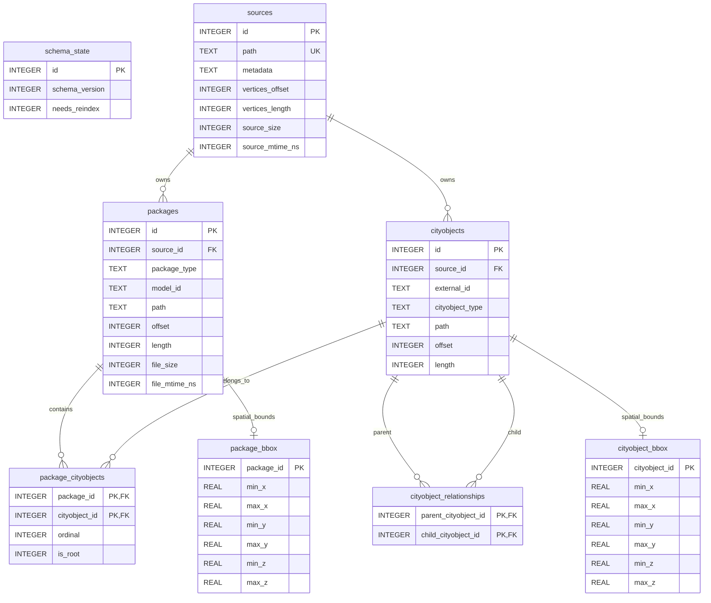

# ADR-008: Normalized Package And CityObject Indexing

## Status

Accepted. Supersedes ADR-006 for public API, schema terminology, and duplicate identifier semantics.

## Context

The previous feature-alias index made CityObject identifiers look like feature identifiers. That hid duplicate occurrences, mixed physical source details into public references, and made it difficult to guarantee that reads from every layout returned valid CityJSONFeature payloads.

## Decision

The index is normalized around sources, packages, CityObjects, package membership, CityObject hierarchy, and 3D bbox tables. Public lookup APIs are plural where duplicate external CityObject ids can exist. Public package reads return valid CityJSONFeature models for `cityjson`, `cityjson-seq`, and `feature-files` package types.

A source is physical reconstruction and freshness context. A package is the public return unit. CityObject records are normalized occurrences and may share the same external id.

The normalized tables are also the performance path. Regular CityJSON package
reads must be reconstructed from package membership and CityObject fragment
ranges, not by falling back to legacy feature rows. CityJSONSeq and
feature-files packages may still use their complete package byte ranges for the
fastest whole-package read, but every indexed CityObject must also have a real
fragment range in `cityobjects`.

## Consequences

- `cityjson-seq` replaces user-facing `ndjson` terminology.
- `lookup_cityobject_refs` is plural and returns every matching CityObject occurrence.
- `package_refs_for_cityobject`, `read_package`, `read_packages`, and `get_packages` are the package-oriented read path.
- `package_bbox` and `cityobject_bbox` carry complete XYZ bounds; non-spatial CityObjects remain addressable without bbox records.
- `cityobjects.offset` and `cityobjects.length` are real JSON fragment ranges for every layout; synthetic or ordinal placeholder ranges are invalid.
- Package scans and bbox queries use keyset paging internally so large datasets do not pay offset pagination costs or materialize all refs before reconstruction.
- The schema must not use `features`, `feature_bbox`, or `bbox_map` as a read-path fallback.
- Legacy sidecars are opened only far enough to report that a rebuild is required.
- CLI and bindings must not expose first-match feature lookup conveniences.

## Plan

### The SQLite Schema

Introduce schema version `2`. Legacy sidecars require transactional rebuild
rather than in-place table rewriting.

```sql
PRAGMA foreign_keys = ON;

CREATE TABLE schema_state (
    id              INTEGER PRIMARY KEY CHECK (id = 1),
    schema_version  INTEGER NOT NULL,
    needs_reindex   INTEGER NOT NULL CHECK (needs_reindex IN (0, 1))
);

CREATE TABLE sources (
    id                  INTEGER PRIMARY KEY AUTOINCREMENT,
    path                TEXT NOT NULL UNIQUE,
    metadata            TEXT NOT NULL,
    vertices_offset     INTEGER,
    vertices_length     INTEGER,
    source_size         INTEGER NOT NULL,
    source_mtime_ns     INTEGER NOT NULL,
    CHECK ((vertices_offset IS NULL) = (vertices_length IS NULL))
);

CREATE TABLE packages (
    id                  INTEGER PRIMARY KEY AUTOINCREMENT,
    source_id           INTEGER NOT NULL REFERENCES sources(id) ON DELETE CASCADE,
    package_type        TEXT NOT NULL CHECK (
                            package_type IN ('cityjson', 'cityjson-seq', 'feature-files')
                        ),
    model_id            TEXT NOT NULL,
    path                TEXT NOT NULL,
    offset              INTEGER,
    length              INTEGER,
    file_size           INTEGER NOT NULL,
    file_mtime_ns       INTEGER NOT NULL,
    CHECK ((offset IS NULL) = (length IS NULL))
);

CREATE TABLE cityobjects (
    id                  INTEGER PRIMARY KEY AUTOINCREMENT,
    source_id           INTEGER NOT NULL REFERENCES sources(id) ON DELETE CASCADE,
    external_id         TEXT NOT NULL,
    cityobject_type     TEXT NOT NULL,
    path                TEXT NOT NULL,
    offset              INTEGER NOT NULL,
    length              INTEGER NOT NULL,
    CHECK (offset >= 0),
    CHECK (length > 0),
    UNIQUE (path, offset, length)
);

CREATE TABLE package_cityobjects (
    package_id          INTEGER NOT NULL REFERENCES packages(id) ON DELETE CASCADE,
    cityobject_id       INTEGER NOT NULL REFERENCES cityobjects(id) ON DELETE CASCADE,
    ordinal             INTEGER NOT NULL,
    is_root             INTEGER NOT NULL CHECK (is_root IN (0, 1)),
    PRIMARY KEY (package_id, cityobject_id),
    UNIQUE (package_id, ordinal)
);

CREATE TABLE cityobject_relationships (
    parent_cityobject_id INTEGER NOT NULL REFERENCES cityobjects(id) ON DELETE CASCADE,
    child_cityobject_id  INTEGER NOT NULL REFERENCES cityobjects(id) ON DELETE CASCADE,
    PRIMARY KEY (parent_cityobject_id, child_cityobject_id),
    CHECK (parent_cityobject_id <> child_cityobject_id)
);

CREATE VIRTUAL TABLE package_bbox USING rtree(
    package_id, min_x, max_x, min_y, max_y, min_z, max_z
);

CREATE VIRTUAL TABLE cityobject_bbox USING rtree(
    cityobject_id, min_x, max_x, min_y, max_y, min_z, max_z
);

CREATE INDEX packages_source_id_idx ON packages(source_id);
CREATE INDEX packages_model_id_idx ON packages(model_id);
CREATE INDEX cityobjects_external_id_idx ON cityobjects(external_id);
CREATE INDEX cityobjects_type_idx ON cityobjects(cityobject_type);
CREATE INDEX cityobjects_source_id_idx ON cityobjects(source_id);
CREATE INDEX package_cityobjects_package_order_idx
    ON package_cityobjects(package_id, ordinal, cityobject_id);
CREATE INDEX package_cityobjects_cityobject_id_idx
    ON package_cityobjects(cityobject_id, package_id);
CREATE INDEX cityobject_relationships_child_idx
    ON cityobject_relationships(child_cityobject_id);

INSERT INTO schema_state (id, schema_version, needs_reindex)
VALUES (1, 2, 0);
```

#### Schema Operation

The schema separates physical storage, valid return packages, and directly
addressable CityObjects. A caller retrieves public package or CityObject refs;
the backend follows private SQLite locations only while reconstructing a valid
`CityJSONFeature`.

| Table | Purpose | Operation |
|---|---|---|
| `schema_state` | Singleton sidecar compatibility record. | The fixed `id = 1` row records the schema version and whether reads must stop until reindexing. Opening a legacy sidecar creates or updates this gate with `needs_reindex = 1`; opening an unknown future version fails. A successful transactional reindex writes version `2` with `needs_reindex = 0`. |
| `sources` | Private physical reconstruction and freshness context. | One row caches serialized metadata and source file status. Regular `cityjson` sources also store the shared top-level `vertices` byte range. `cityjson-seq` sources cache the stream header. `feature-files` sources point to the nearest ancestor metadata file. Reads reuse this row instead of duplicating metadata or shared vertices for every package. |
| `packages` | Valid `CityJSONFeature` return units. | One row represents exactly one package that can be returned publicly. A package is synthetic for regular `cityjson`, an original feature line for `cityjson-seq`, or an original standalone feature file for `feature-files`. `model_id` is the returned feature ID. Private path and optional byte ranges drive backend reads but are absent from public refs. |
| `cityobjects` | Directly addressable physical CityObject occurrences. | One row indexes each JSON CityObject fragment once with its external ID, type, and private byte range. These ranges are real byte ranges in every layout. `external_id` is deliberately non-unique: repeated IDs in different packages remain distinct records and plural lookup returns all occurrences. |
| `package_cityobjects` | Ordered many-to-many package membership. | This join table records which CityObjects belong to each package, their deterministic reconstruction order, and whether each member is a root. A shared descendant may belong to multiple synthetic regular-CityJSON packages without duplicating its `cityobjects` row. |
| `cityobject_relationships` | Normalized parent-child graph. | Each deduplicated edge is stored once regardless of whether input JSON expressed it through `parents`, `children`, or both. Scanning rejects missing targets, self-links, and cycles. Traversal, descendant-inclusive bounds, and synthetic-package assembly use this graph. |
| `package_bbox` | Optional XYZ spatial index for packages. | One RTree row exists only for a spatial package. Package bbox queries use it to return each matching package once even when multiple members intersect the window. |
| `cityobject_bbox` | Optional XYZ spatial index for CityObjects. | One RTree row exists only for a CityObject with geometry or spatial descendants. Granular bbox queries use it. Non-spatial CityObjects remain addressable by ID without an RTree row. |

Supporting indexes keep the common access paths explicit:

| Index | Supports |
|---|---|
| `packages_source_id_idx` | Source-owned cleanup and reconstruction grouping. |
| `packages_model_id_idx` | Package model-ID lookup and diagnostics. |
| `cityobjects_external_id_idx` | Plural external-ID lookup. |
| `cityobjects_type_idx` | CityObject type lookup and diagnostics. |
| `cityobjects_source_id_idx` | Source-owned cleanup and reconstruction grouping. |
| `package_cityobjects_package_order_idx` | Fast package reconstruction in deterministic member order. |
| `package_cityobjects_cityobject_id_idx` | Finding every containing package for one CityObject occurrence. |
| `cityobject_relationships_child_idx` | Reverse traversal from child to parents. |

`sources` remain separate from `packages`:

- A source is an internal physical reconstruction and freshness context. It
  owns metadata and shared vertices.
- A package is a valid CityJSONFeature return unit.
- One source may yield many packages without duplicating cached metadata or
  vertices.
- `source_id` is private and must not appear in public refs.

Package mapping:

| Type | Source record | Package record |
|---|---|---|
| `cityjson` | One shared `.city.json` document | One synthetic root-descendant package per parentless root. |
| `cityjson-seq` | One `.city.jsonl` stream and cached header | One original feature line. |
| `feature-files` | Nearest ancestor metadata context | One standalone feature file. |

Package byte ranges follow the fastest semantically correct read path:

| Type | `packages.offset` and `packages.length` | Reason |
|---|---|---|
| `cityjson` | Both `NULL`. | The package is synthetic: a root and its descendants need not be contiguous. Reconstruction follows memberships and CityObject fragment ranges, then localizes shared vertices. |
| `cityjson-seq` | Exact feature-line byte range. | The backend reads the complete original feature with one direct slice from the stream. |
| `feature-files` | `offset = 0`, `length = file_size`. | The backend reads the complete standalone feature file directly. |

Store XYZ bounds only in RTrees. Non-spatial records have no RTree entry.
SQLite RTree floating-point behavior is accepted for indexed reference bounds;
revisit the schema before implementation if exact source `f64` bounds are
required.

The v2 schema does not create or maintain legacy `features`, `feature_bbox`, or
`bbox_map` tables. Those tables were the bridge from the older feature-oriented
index to the package-oriented design; keeping them as a fallback would recreate
the inconsistent layout handling this ADR removes.

#### Entity Relationships

RTree relations are shown as logical optional one-to-one links. SQLite virtual
tables do not enforce these foreign keys themselves.



#### Layout Examples

The examples use one Building root named `building` with one BuildingPart child
named `part`. Offsets and lengths are illustrative byte positions.

##### Regular `cityjson`

Input storage:

```text
tile.city.json
  metadata + transform
  CityObjects:
    building -> Building, children = ["part"]
    part     -> BuildingPart, parents = ["building"], geometry = [...]
  vertices: [...]
```

Normalized rows:

```text
sources:
  (id=1, path="tile.city.json", metadata=<base CityJSON>,
   vertices_offset=8000, vertices_length=900, ...)

packages:
  (id=10, source_id=1, package_type="cityjson", model_id="building",
   path="tile.city.json", offset=NULL, length=NULL, ...)

cityobjects:
  (id=100, source_id=1, external_id="building", cityobject_type="Building",
   path="tile.city.json", offset=1200, length=180)
  (id=101, source_id=1, external_id="part", cityobject_type="BuildingPart",
   path="tile.city.json", offset=2400, length=420)

package_cityobjects:
  (package_id=10, cityobject_id=100, ordinal=0, is_root=1)
  (package_id=10, cityobject_id=101, ordinal=1, is_root=0)

cityobject_relationships:
  (parent_cityobject_id=100, child_cityobject_id=101)
```

The scanner indexes each physical CityObject fragment once, discovers the
parentless root, and creates one synthetic package from the root-descendant
closure. On `read_package`, the backend reads the package memberships,
CityObject fragments, cached shared vertices, and base metadata; it localizes
vertex indices and removes only relationships that point outside the package.

##### `cityjson-seq`

Input storage:

```text
stream.city.jsonl
  line 1: CityJSON header with metadata + transform
  line 2: {"type":"CityJSONFeature","id":"feature-1",
           "CityObjects":{"building":{...},"part":{...}},"vertices":[...]}
```

Normalized rows:

```text
sources:
  (id=2, path="stream.city.jsonl", metadata=<line 1 header>,
   vertices_offset=NULL, vertices_length=NULL, ...)

packages:
  (id=20, source_id=2, package_type="cityjson-seq", model_id="feature-1",
   path="stream.city.jsonl", offset=240, length=1100, ...)

cityobjects:
  (id=200, source_id=2, external_id="building", cityobject_type="Building",
   path="stream.city.jsonl", offset=360, length=180)
  (id=201, source_id=2, external_id="part", cityobject_type="BuildingPart",
   path="stream.city.jsonl", offset=560, length=420)
```

Membership and relationship rows match the regular-CityJSON example. The
scanner validates the original feature line, records its exact package byte
range, and records exact byte ranges for each contained CityObject fragment.
On `read_package`, the backend slices that line directly and combines it with
the cached header while preserving `model_id = "feature-1"`.

##### `feature-files`

Input storage:

```text
metadata.json
features/
  feature-1.city.jsonl
    {"type":"CityJSONFeature","id":"feature-1",
     "CityObjects":{"building":{...},"part":{...}},"vertices":[...]}
```

Normalized rows:

```text
sources:
  (id=3, path="metadata.json", metadata=<ancestor metadata>,
   vertices_offset=NULL, vertices_length=NULL, ...)

packages:
  (id=30, source_id=3, package_type="feature-files", model_id="feature-1",
   path="features/feature-1.city.jsonl", offset=0, length=980, file_size=980, ...)

cityobjects:
  (id=300, source_id=3, external_id="building", cityobject_type="Building",
   path="features/feature-1.city.jsonl", offset=120, length=180)
  (id=301, source_id=3, external_id="part", cityobject_type="BuildingPart",
   path="features/feature-1.city.jsonl", offset=320, length=420)
```

Membership and relationship rows again match the regular-CityJSON example.
The scanner resolves the nearest ancestor metadata file, validates the
standalone feature, and records exact byte ranges for each contained CityObject
fragment. On `read_package`, the backend reads `0..file_size` from the feature
file and combines it with cached ancestor metadata while preserving
`model_id = "feature-1"`.

#### Layout-Independent API Flow

Public refs intentionally hide source IDs, file paths, and byte ranges. The
same calls work for all three layouts:

```rust
let occurrences = index.lookup_cityobject_refs("part")?;
for occurrence in occurrences {
    let packages = index.package_refs_for_cityobject(&occurrence)?;
    let reconstructed = index.read_packages(&packages)?;
    // Each item is a valid package regardless of its physical layout.
}

let packages = index.get_packages("part")?;
let package_hits = index.query_package_refs(&bbox)?;
let cityobject_hits = index.query_cityobject_refs(&bbox)?;
```

| API | Public behavior | Internal operation |
|---|---|---|
| `lookup_cityobject_refs("part")` | Returns every physical occurrence ordered by CityObject record ID. | Uses `cityobjects_external_id_idx`; duplicate external IDs remain separate. |
| `package_refs_for_cityobject(&occurrence)` | Returns each containing package once in package-record order. | Joins `package_cityobjects` to `packages`. A shared regular-CityJSON child may return multiple synthetic packages. |
| `get_packages("part")` | Returns every distinct valid containing package for every matching occurrence. | Performs plural CityObject lookup, deduplicates package record IDs, and dispatches reconstruction by `PackageType`. |
| `read_package(&package)` | Returns one valid `CityJSONFeature`. | For `cityjson`, assembles member fragments and shared vertices. For `cityjson-seq`, slices one stream line. For `feature-files`, reads one complete feature file. |
| `query_package_refs(&bbox)` | Returns each intersecting package once. | Queries `package_bbox`; multiple matching members do not duplicate a package. |
| `query_cityobject_refs(&bbox)` | Returns granular directly matching CityObject occurrences. | Queries `cityobject_bbox`; descendant-inclusive bounds make geometry-less spatial parents queryable. |

Scanner replacements:

```rust
struct ScannedSource { /* metadata, shared vertices, freshness */ }
struct ScannedPackage { /* type, model ID, location, bounds */ }
struct ScannedCityObject { /* external ID, type, fragment range, bounds */ }
struct ScannedPackageCityObject { /* package, object, ordinal, is_root */ }
struct ScannedCityObjectRelationship { /* parent, child */ }
```

Scanner rules:

1. Index every physical CityObject fragment once.
2. Store exact CityObject fragment byte ranges for all package layouts; never
   store ordinal placeholders or synthetic ranges.
3. Normalize `parents` and `children` into deduplicated relationships.
4. Reject absent targets, self-links, and cycles.
5. Compute descendant-inclusive CityObject bounds and package bounds.
6. Preserve every geometry and string LoD.
7. Allow duplicate external IDs.
8. Validate original CityJSONSeq and feature-file packages during reindex.
9. Create deterministic synthetic CityJSON packages per parentless root.
10. Permit shared descendants in multiple packages.
11. Scan fully before transactionally replacing the prior index.

### Rust APIs And Reconstruction

#### Layout Types

```rust
pub enum DatasetLayoutKind {
    CityJson,
    CityJsonSeq,
    FeatureFiles,
}

pub enum StorageLayout {
    CityJson { paths: Vec<PathBuf> },
    CityJsonSeq { paths: Vec<PathBuf> },
    FeatureFiles { /* existing fields */ },
}
```

Serialized layout names are exactly:

```text
cityjson
cityjson-seq
feature-files
```

Rename backend and helper identifiers from `Ndjson*` to `CityJsonSeq*`.

#### Public Types

```rust
/// Axis-aligned XYZ bounds for an indexed package or CityObject.
pub struct Bounds3D {
    pub min_x: f64, pub max_x: f64,
    pub min_y: f64, pub max_y: f64,
    pub min_z: f64, pub max_z: f64,
}

/// CityJSON ecosystem package type used during reconstruction.
pub enum PackageType {
    CityJson,
    CityJsonSeq,
    FeatureFiles,
}

/// Lightweight package reference without private storage locations.
pub struct IndexedPackageRef {
    pub record_id: i64,
    pub model_id: String,
    pub package_type: PackageType,
    pub bounds: Option<Bounds3D>,
}

/// Lightweight directly addressable physical CityObject occurrence.
pub struct IndexedCityObjectRef {
    pub record_id: i64,
    pub external_id: String,
    pub cityobject_type: String,
    pub bounds: Option<Bounds3D>,
}

/// Reconstructed valid package together with its stable ref and metadata.
pub struct IndexedPackage {
    pub reference: IndexedPackageRef,
    pub metadata: Arc<Meta>,
    pub model: CityModel,
}
```

#### Package APIs

```rust
/// Returns every physical occurrence matching `external_id`, ordered by record ID.
pub fn lookup_cityobject_refs(
    &self,
    external_id: &str,
) -> Result<Vec<IndexedCityObjectRef>>;

/// Returns every distinct package containing `cityobject`, ordered by package record ID.
pub fn package_refs_for_cityobject(
    &self,
    cityobject: &IndexedCityObjectRef,
) -> Result<Vec<IndexedPackageRef>>;

/// Returns every distinct valid package containing any occurrence of `external_id`.
///
/// Packages are deduplicated by package record ID and returned in record-ID order.
pub fn get_packages(&self, external_id: &str) -> Result<Vec<CityModel>>;

/// Returns every distinct package and its reconstruction metadata.
///
/// Packages are deduplicated by package record ID and returned in record-ID order.
pub fn get_packages_with_metadata(
    &self,
    external_id: &str,
) -> Result<Vec<(Arc<Meta>, CityModel)>>;

/// Reconstructs every package containing this exact CityObject occurrence.
pub fn read_cityobject_packages(
    &self,
    cityobject: &IndexedCityObjectRef,
) -> Result<Vec<IndexedPackage>>;

/// Returns one stable keyset package-ref page ordered by package record ID.
pub fn package_ref_page_after_record_id(
    &self,
    after_record_id: Option<i64>,
    limit: usize,
) -> Result<Vec<IndexedPackageRef>>;

/// Returns each package intersecting `bbox` once, ordered by package record ID.
pub fn query_package_refs(&self, bbox: &BBox) -> Result<Vec<IndexedPackageRef>>;

/// Returns one stable keyset page of packages intersecting `bbox`.
pub fn query_package_refs_page(
    &self,
    bbox: &BBox,
    after_package_id: Option<i64>,
    limit: usize,
) -> Result<Vec<IndexedPackageRef>>;

/// Returns every directly matching CityObject occurrence ordered by record ID.
pub fn query_cityobject_refs(&self, bbox: &BBox)
    -> Result<Vec<IndexedCityObjectRef>>;

/// Returns breadth-first descendants once, in deterministic relationship order.
pub fn descendant_cityobject_refs(&self, cityobject: &IndexedCityObjectRef)
    -> Result<Vec<IndexedCityObjectRef>>;

/// Reconstructs packages in request order while decoding each distinct record once.
pub fn read_packages(&self, packages: &[IndexedPackageRef])
    -> Result<Vec<IndexedPackage>>;

/// Filters packages while preserving one aligned result per requested ref.
pub fn read_filtered_packages(
    &self,
    packages: &[IndexedPackageRef],
    filter: &PackageFilter,
) -> Result<Vec<PackageFilterResult>>;
```

Do not add first-match variants.

Retain unique-record operations:

```rust
pub fn lookup_package_ref_by_record_id(
    &self,
    record_id: i64,
) -> Result<Option<IndexedPackageRef>>;

pub fn read_package(&self, package: &IndexedPackageRef) -> Result<CityModel>;

pub fn read_package_by_record_id(
    &self,
    record_id: i64,
) -> Result<Option<IndexedPackage>>;
```

Keep keyset-paginated package APIs, package bbox queries, granular CityObject
bbox queries, relationship traversal, batch package reads, and metadata-aware
query variants. Package queries deduplicate by package `record_id`. Eager
package-ref collection APIs are convenience wrappers over paged queries.

#### Read-Path Performance Requirements

Regular CityJSON package reconstruction must use the normalized membership
graph directly:

1. Resolve requested package ids to package rows and source rows.
2. Fetch all package members with one batched query over
   `package_cityobjects JOIN cityobjects`, ordered by `(package_id, ordinal)`.
3. Group reconstruction work by source file, read member fragments in stable
   order, and reuse cached shared vertices from the source row.
4. Return packages in request order and decode each distinct package record at
   most once per `read_packages` call.

CityJSONSeq and feature-files package reconstruction may read the complete
package byte slice directly, because those packages are physically contiguous.
Their CityObject fragment rows still remain authoritative for CityObject lookup,
package membership, relationship traversal, and bbox semantics.

The implementation must not add a package-level JSON member cache in this pass.
The normalized membership tables are the source of truth; performance comes
from exact fragment ranges, covering indexes, batched reads, and keyset
pagination.

#### Filtering

Replace separate diagnostics and summary types with one mergeable report:

```rust
/// CityObject-type and LoD selection applied to complete valid packages.
pub struct PackageFilter {
    pub cityobject_types: Option<BTreeSet<String>>,
    pub default_lod: LodSelection,
    pub lods_by_type: BTreeMap<String, LodSelection>,
}

impl PackageFilter {
    /// Applies this selection without manufacturing an invalid empty feature.
    pub fn apply(&self, model: &CityModel) -> Result<PackageFilterResult>;
}

pub struct PackageFilterReport {
    pub available_types: BTreeSet<String>,
    pub retained_types: BTreeSet<String>,
    pub ignored_types: BTreeSet<String>,
    pub available_lods: BTreeMap<String, BTreeSet<String>>,
    pub retained_lods: BTreeMap<String, BTreeSet<String>>,
    pub missing_lods: BTreeMap<String, MissingLodSelection>,
    pub retained_geometry_count: usize,
    pub retained_package_count: usize,
    pub ignored_package_count: usize,
}

pub struct PackageFilterResult {
    pub model: Option<CityModel>,
    pub report: PackageFilterReport,
}

impl PackageFilterReport {
    /// Merges package outcomes for batch validation and user-facing summaries.
    pub fn merge(&mut self, other: &PackageFilterReport);

    /// Rejects explicit LoD requests that matched no geometry in the batch.
    pub fn ensure_requested_lods_available(&self, filter: &PackageFilter) -> Result<()>;
}
```

`PackageFilter::apply` returns `model = None` when no geometry survives. Delete
`extract_or_empty_feature`.
